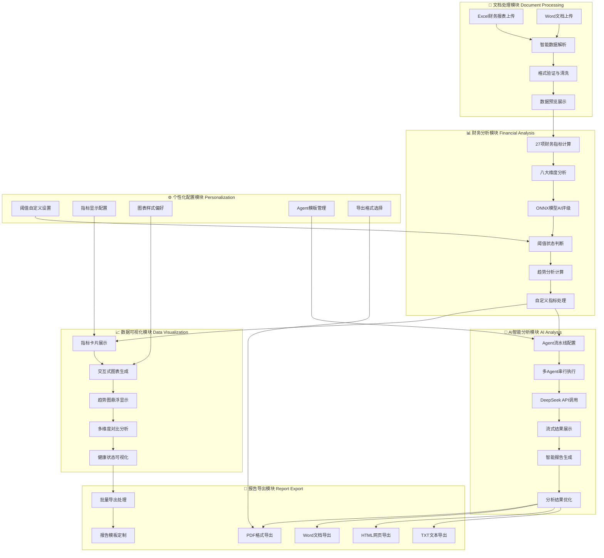
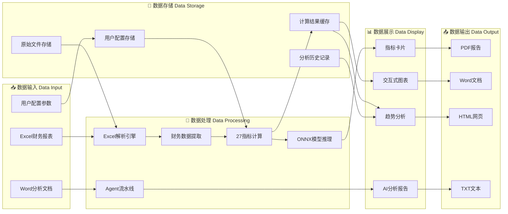

## 📊 智能财报分析系统 - 项目全貌

### 🎯 项目概述
这是一个基于 **Next.js 15.2.4** 的现代化智能财务报表分析系统，集成了**多Agent AI分析**、**ONNX机器学习模型**和**完整的数据可视化**功能，专为投资者、财务分析师和企业用户设计，提供从数据上传到智能报告生成的完整财务分析解决方案。

### 🚀 **最新版本亮点 (v2.0)**
- ✅ **完整的四大核心模块**：数据预览、财务指标总览、图表展示、智能报告
- ✅ **27个专业财务指标**：覆盖八大分析维度的全面财务评估
- ✅ **ONNX AI评级系统**：企业健康度智能评估（A/B/C/D等级）
- ✅ **多Agent智能分析**：可配置的AI分析流水线，支持DeepSeek API
- ✅ **多格式导出系统**：PDF、Word、HTML、TXT四种格式完整导出
- ✅ **交互式图表系统**：支持柱状图/折线图切换，多维度数据可视化
- ✅ **趋势分析功能**：悬浮显示历史趋势，智能变化率计算
- ✅ **阈值配置系统**：个性化健康状态判断标准设置

### 🏗️ 技术架构

**前端技术栈：**
- **Next.js 15.2.4** - React全栈框架
- **TypeScript** - 类型安全开发
- **Tailwind CSS** - 原子化CSS框架
- **Radix UI** - 无障碍UI组件库
- **Recharts** - 数据可视化图表库
- **Lucide React** - 现代图标库

**AI & 机器学习：**
- **DeepSeek API** - 大语言模型API集成
- **ONNX Runtime** - 企业健康度评级模型
- **多Agent系统** - 可配置的智能分析流水线
- **流式处理** - 实时AI分析结果展示

**数据处理：**
- **xlsx** - Excel文件解析
- **mammoth** - Word文档解析
- **自定义财务数据提取器** - 智能识别财务报表结构
- **27个财务指标计算引擎** - 涵盖偿债、盈利、营运、发展能力分析

**文件处理：**
- **formidable** - 文件上传处理
- **docx** - Word文档生成
- **html2canvas & jsPDF** - 多格式报告导出

### 📁 项目结构

````
├── app/                           # Next.js应用目录
│   ├── api/                       # API路由
│   │   ├── agent/                 # AI Agent执行接口
│   │   ├── upload-docx/           # Word文档上传
│   │   ├── check-model/           # ONNX模型状态检查
│   │   └── financial-data-extractor.ts # 财务数据提取
│   ├── dashboard.tsx              # 主仪表板页面
│   ├── layout.tsx                 # 应用布局
│   └── page.tsx                   # 首页
├── components/                    # React组件
│   ├── dashboard/                 # 仪表板组件
│   │   ├── charts/                # 图表组件
│   │   ├── communication/         # AI通信组件
│   │   ├── financial-metrics/     # 财务指标组件
│   │   ├── modals/                # 模态框组件
│   │   ├── hooks/                 # 自定义Hooks
│   │   ├── types/                 # TypeScript类型定义
│   │   └── utils/                 # 工具函数
│   ├── ui/                        # 基础UI组件
│   ├── excel-preview-container.tsx # Excel预览容器
│   ├── file-upload-sidebar.tsx    # 文件上传侧边栏
│   └── theme-provider.tsx         # 主题提供者
├── public/                        # 静态资源
│   ├── models/                    # ONNX模型文件
│   └── onnx/                      # ONNX运行时文件
├── uploads/                       # 文件上传目录
├── utils/                         # 通用工具函数
│   ├── contentConverter.ts        # 内容转换器
│   └── exportUtils.ts             # 导出工具
└── lib/                           # 核心库文件
````

### ✨ 核心功能模块

#### 🔄 **已实现功能** (v2.0 完整版)

##### 1. **智能文件管理系统** (`FileUploadSidebar`)
- ✅ 支持拖拽上传Excel财务报表文件
- ✅ 文件列表管理，支持选择和删除
- ✅ 存储空间使用情况显示
- ✅ 文件预览功能
- ✅ 多文件批量处理支持

##### 2. **Excel数据解析与预览** (`ExcelPreviewContainer`)
- ✅ 自动识别资产负债表、利润表、现金流量表
- ✅ 响应式表格展示，支持排序和滚动
- ✅ Tab方式切换不同工作表
- ✅ 智能数据格式化处理
- ✅ 数据验证和错误提示

##### 3. **财务指标计算引擎** (`financial-data-extractor.ts`)
- ✅ **27个核心财务指标**自动计算
- ✅ 基于Excel数据的智能提取算法
- ✅ 详细计算公式展示
- ✅ 一键批量计算功能
- ✅ 八大分析维度完整覆盖

##### 4. **财务指标总览仪表板** (`FinancialMetricsOverview`)
- ✅ 27个财务指标卡片式展示
- ✅ 基于阈值的健康状态指示（健康/警告/危险）
- ✅ 响应式网格布局（1-4列自适应）
- ✅ 自动数值格式化（%、次、天、倍等单位）
- ✅ 悬浮显示计算公式

##### 5. **ONNX机器学习评级系统** (`EnterpriseHealthCard`)
- ✅ 企业健康度AI评级（A/B/C/D等级）
- ✅ 基于27个财务指标的智能评估
- ✅ 实时置信度显示
- ✅ 客户端ONNX模型推理
- ✅ 用户反馈收集系统

##### 6. **多Agent智能分析系统** (`CommunicationLog`)
- ✅ 可配置的AI Agent流水线
- ✅ 支持Word文档上传和解析
- ✅ DeepSeek API集成
- ✅ 流式AI分析结果展示
- ✅ 智能报告生成
- ✅ Agent执行状态实时监控

##### 7. **智能阈值配置系统** (`ThresholdModal`)
- ✅ 按分类管理指标阈值
- ✅ 三级阈值设置（健康、警告、危险）
- ✅ 实时预览颜色变化
- ✅ 本地存储持久化
- ✅ 批量阈值导入/导出

##### 8. **交互式趋势分析** (`TrendChart`)
- ✅ 鼠标悬浮800ms后显示趋势图
- ✅ 支持柱状图和折线图切换
- ✅ 三年历史数据对比
- ✅ 自动计算变化率
- ✅ 趋势预测功能

##### 9. **多维度图表展示系统** (`FinancialChartsDisplay`)
- ✅ 多指标对比可视化
- ✅ 支持年度、季度、月度时间维度
- ✅ 升序/降序排列控制
- ✅ 交互式数据提示
- ✅ 图表类型动态切换
- ✅ 数据统计信息显示

##### 10. **多格式导出系统** (`exportUtils.ts`)
- ✅ 支持PDF、Word、HTML、TXT格式导出
- ✅ 智能报告格式化
- ✅ 图表和数据完整导出
- ✅ 自定义导出选项
- ✅ 批量导出功能

##### 11. **自定义指标系统** (`CustomMetricModal`)
- ✅ 用户自定义财务指标
- ✅ 复杂公式计算支持
- ✅ 指标分组管理
- ✅ 实时计算验证
- ✅ 指标模板库

##### 12. **响应式UI系统**
- ✅ 专业深色主题设计
- ✅ 渐变动画效果
- ✅ 完美适配各种屏幕尺寸
- ✅ 状态颜色编码系统
- ✅ 粒子背景效果

#### 🚀 **规划中功能** (v3.0 路线图)

##### 13. **用户认证与权限系统**
- 🔄 邀请码验证机制
- 🔄 用户注册流程
- 🔄 安全登录验证
- 🔄 JWT令牌管理
- 🔄 权限级别控制

##### 14. **个人空间管理中心**
- 🔄 个人文档库管理
- 🔄 文档上传/下载功能
- 🔄 文档分类和标签
- 🔄 存储配额管理
- 🔄 分析历史追踪

##### 15. **高级个性化配置**
- 🔄 自定义指标阈值
- 🔄 个人偏好设置
- 🔄 指标显示配置
- 🔄 报告模板定制
- 🔄 个人Agent模板库

##### 16. **企业级功能**
- 🔄 团队协作功能
- 🔄 报告分享机制
- 🔄 数据安全控制
- 🔄 批量分析处理
- 🔄 API接口开放

##### 17. **高级分析功能**
- 🔄 行业对比分析
- 🔄 预测模型集成
- 🔄 风险评估系统
- 🔄 投资建议生成
- 🔄 实时数据更新

### 🏛️ 系统架构图

#### 📋 完整技术架构图

> **注意**: 如果您在GitHub上查看此文档，下面的Mermaid图表会自动渲染。如果看不到图表，请查看文本版本的架构描述。

```mermaid
graph TB
    subgraph "🖥️ 前端展示层 Frontend Presentation Layer"
        A1[Next.js 15.2.4 应用框架]
        A2[React 18 组件系统]
        A3[Tailwind CSS 样式引擎]
        A4[TypeScript 类型系统]
        A5[Radix UI 组件库]
        A6[Recharts 图表库]
    end

    subgraph "⚙️ 业务逻辑层 Business Logic Layer"
        B1[财务数据处理引擎]
        B2[27指标计算系统]
        B3[多Agent AI流水线]
        B4[ONNX模型推理]
        B5[图表数据生成]
        B6[导出格式转换]
    end

    subgraph "🔌 API服务层 API Service Layer"
        C1[/api/agent - AI分析执行]
        C2[/api/upload-docx - 文档处理]
        C3[/api/check-model - 模型状态]
        C4[/api/financial-data-extractor - 数据提取]
    end

    subgraph "💾 数据存储层 Data Storage Layer"
        D1[uploads/ - 文件存储]
        D2[localStorage - 用户配置]
        D3[public/models/ - ONNX模型]
        D4[临时数据缓存]
    end

    subgraph "🌐 外部服务层 External Services"
        E1[DeepSeek API - 大语言模型]
        E2[ONNX Runtime - 机器学习]
        E3[Node.js 文件系统]
    end

    subgraph "📊 核心功能模块 Core Modules"
        F1[FileUploadSidebar - 文件管理]
        F2[ExcelPreviewContainer - 数据预览]
        F3[FinancialMetricsOverview - 指标总览]
        F4[FinancialChartsDisplay - 图表展示]
        F5[CommunicationLog - 智能报告]
        F6[EnterpriseHealthCard - AI评级]
    end

    A1 --> A2
    A2 --> A3
    A3 --> A4
    A4 --> A5
    A5 --> A6

    A2 --> F1
    A2 --> F2
    A2 --> F3
    A2 --> F4
    A2 --> F5
    A2 --> F6

    F1 --> B1
    F2 --> B1
    F3 --> B2
    F4 --> B5
    F5 --> B3
    F6 --> B4

    B1 --> C4
    B2 --> C4
    B3 --> C1
    B4 --> C3
    B6 --> C2

    C1 --> E1
    C2 --> E3
    C3 --> E2
    C4 --> E3

    C1 --> D1
    C2 --> D1
    C3 --> D3
    C4 --> D4

    B2 --> D2
    B5 --> D2
```

**📝 文本版技术架构说明:**
```
┌─────────────────────────────────────────────────────────────┐
│                    🖥️ 前端展示层 Frontend Layer              │
│  Next.js 15.2.4 → React 18 → Tailwind CSS → TypeScript    │
│       ↓              ↓           ↓            ↓            │
│  Radix UI组件 → Recharts图表 → 响应式布局 → 类型安全       │
└─────────────────────────┬───────────────────────────────────┘
                          ↓
┌─────────────────────────────────────────────────────────────┐
│                   ⚙️ 业务逻辑层 Business Logic Layer        │
│  财务数据处理 → 27指标计算 → 多Agent AI → ONNX推理         │
│       ↓              ↓           ↓            ↓            │
│  图表数据生成 → 导出转换 → 状态管理 → 缓存优化             │
└─────────────────────────┬───────────────────────────────────┘
                          ↓
┌─────────────────────────────────────────────────────────────┐
│                    🔌 API服务层 API Service Layer           │
│  /api/agent → /api/upload-docx → /api/check-model         │
│       ↓              ↓                ↓                   │
│  AI分析执行 → 文档处理 → /api/financial-data-extractor     │
└─────────────────────────┬───────────────────────────────────┘
                          ↓
┌─────────────────────────────────────────────────────────────┐
│                   💾 数据存储层 Data Storage Layer          │
│  uploads/文件 → localStorage配置 → public/models/         │
│       ↓              ↓                    ↓               │
│  临时缓存 → 用户偏好 → ONNX模型文件 → 分析历史             │
└─────────────────────────┬───────────────────────────────────┘
                          ↓
┌─────────────────────────────────────────────────────────────┐
│                   🌐 外部服务层 External Services           │
│  DeepSeek API → ONNX Runtime → Node.js文件系统            │
│       ↓              ↓              ↓                     │
│  大语言模型 → 机器学习推理 → 文件操作                       │
└─────────────────────────────────────────────────────────────┘
```

#### 🔄 完整业务流程架构图



#### 🔄 系统数据流向架构图



**📝 文本版业务流程说明:**
```
📁 文档处理流程:
Excel财务报表上传 → 智能数据解析 → 格式验证与清洗 → 数据预览展示
Word文档上传 ↗

📊 财务分析流程:
27项财务指标计算 → 八大维度分析 → ONNX模型AI评级 → 阈值状态判断 → 趋势分析计算

📈 数据可视化流程:
指标卡片展示 → 交互式图表生成 → 趋势图悬浮显示 → 多维度对比分析 → 健康状态可视化

🤖 AI智能分析流程:
Agent流水线配置 → 多Agent串行执行 → DeepSeek API调用 → 流式结果展示 → 智能报告生成

⚙️ 个性化配置流程:
阈值自定义设置 → 指标显示配置 → 图表样式偏好 → Agent模板管理 → 导出格式选择

📄 报告导出流程:
PDF/Word/HTML/TXT格式导出 → 批量导出处理 → 报告模板定制
```

### 📊 财务指标体系

**八大分析维度：**

1. **基本会计数据** (4个指标)
    - 资产总额、负债总额、净资产、所有者权益

2. **偿债能力分析** (5个指标)
    - 流动比率、速动比率、资产负债率、现金比率、现金流动负债比

3. **盈利能力分析** (6个指标)
    - 主营业务毛利率、主营业务净利率、资产净利率、净资产收益率、成本费用利润率、营业费用率

4. **营运能力分析** (5个指标)
    - 应收账款周转率、存货周转率、总资产周转率、应收账款周转天数、存货周转天数

5. **资本状况分析** (2个指标)
    - 资本保值增值率、资本积累率

6. **现金流量分析** (4个指标)
    - 净现比、收现比、现金比率、现金流动负债比

7. **杜邦分析体系** (2个指标)
    - 权益乘数、权益净利率

8. **智能评级分析** (1个指标)
    - 企业健康度AI评级（基于ONNX模型）

### 🎨 界面特色

- **专业深色主题** - 护眼的深色界面设计
- **渐变动画效果** - 流畅的交互动画
- **响应式布局** - 完美适配各种屏幕尺寸
- **状态颜色编码** - 直观的健康状态指示
- **悬浮趋势图** - 创新的hover显示功能
- **粒子背景效果** - 动态背景增强视觉体验

### 🔧 核心组件架构

**主要组件：**
- `Dashboard.tsx` - 主仪表板容器
- `FileUploadSidebar` - 文件上传管理
- `ExcelPreviewContainer` - Excel数据预览
- `FinancialMetricsOverview` - 财务指标总览
- `MetricCard` - 财务指标卡片
- `ThresholdModal` - 阈值设置弹窗
- `TrendChart` - 趋势图组件
- `FinancialChartsDisplay` - 图表展示

**状态管理：**
- 使用自定义Hooks进行状态管理
- localStorage本地数据持久化
- React Context API全局状态

### 🚀 完整使用流程

#### 📈 **当前版本完整使用流程 (v2.0)**

##### 🔄 **基础分析流程**
1. **📁 上传财务报表** → 拖拽Excel文件到左侧上传区域
2. **👀 数据预览** → 在"数据预览"标签页查看三张财务报表数据
3. **🧮 计算指标** → 点击"计算财务比率"按钮，自动计算27个财务指标
4. **📊 查看分析** → 切换到"财务指标总览"页面查看分析结果
5. **🤖 AI评级** → 查看ONNX模型生成的企业健康度评级（A/B/C/D等级）

##### ⚙️ **高级配置流程**
6. **🎛️ 设置阈值** → 点击"阈值设置"自定义健康状态判断标准
7. **📈 趋势分析** → 鼠标悬浮指标卡片800ms查看趋势图
8. **📊 图表展示** → 切换到"图表展示"页面进行多维度可视化分析
9. **🔧 自定义指标** → 添加个人自定义财务指标和计算公式

##### 🤖 **智能报告流程**
10. **📄 智能报告** → 切换到"智能报告"标签页
11. **📤 上传文档** → 上传Word文档作为分析背景
12. **🔧 配置Agent** → 设置AI Agent分析流水线
13. **▶️ 执行分析** → 启动多Agent串行分析
14. **👁️ 实时监控** → 观看流式AI分析结果展示

##### 📄 **导出分享流程**
15. **💾 导出报告** → 选择PDF、Word、HTML、TXT格式导出
16. **📋 批量处理** → 支持多文件批量分析和导出
17. **🎨 模板定制** → 自定义报告模板和样式

#### 🔮 **未来版本使用流程 (v3.0 规划)**

##### 👥 **用户系统流程**
1. **🎫 邀请码注册** → 使用邀请码创建个人账户
2. **🔐 安全登录** → 用户名密码登录系统
3. **🏠 个人空间** → 进入个人文档管理中心

##### 📁 **个人化管理流程**
4. **📚 文档管理** → 上传、分类、管理个人文档库
5. **⚙️ 配置偏好** → 设置个人财务指标和Agent偏好
6. **📊 历史追踪** → 查看分析历史和趋势对比
7. **🤝 团队协作** → 报告分享和团队协作功能

### 📈 项目特点与优势

#### 🎯 **核心优势 (v2.0 完整版)**

- **🤖 AI驱动分析** - 集成多Agent系统和ONNX机器学习模型，提供智能化财务分析
- **📊 专业财务分析** - 27个专业财务指标，覆盖八大分析维度的全面财务评估
- **🔄 智能数据处理** - 自动识别Excel表格结构，智能数据提取和验证
- **📈 丰富可视化** - 交互式图表、趋势图、悬浮分析等多维度数据展示
- **⚡ 实时响应** - 流式AI分析、实时结果展示、即时状态反馈
- **🎨 现代化界面** - 专业深色主题、流畅动画效果、粒子背景
- **📱 完全响应式** - 完美适配桌面、平板、手机等各种设备
- **🔧 高度可扩展** - 模块化设计、组件化架构、便于功能扩展

#### 🚀 **技术亮点 (v2.0 新特性)**

- **🔗 多Agent架构** - 可配置的AI分析流水线，支持串行Agent执行
- **🧠 ONNX模型集成** - 客户端机器学习模型推理，企业健康度智能评级
- **🌊 流式数据处理** - 实时AI分析结果展示，支持大数据量处理
- **📄 多格式文档支持** - Excel、Word文档处理和PDF、HTML、TXT导出
- **💾 智能缓存系统** - localStorage优化、数据持久化、性能提升
- **🔒 完整类型安全** - TypeScript类型系统、运行时错误预防
- **📊 高性能图表** - Recharts集成、交互式数据可视化
- **🎛️ 个性化配置** - 自定义阈值、指标配置、Agent模板管理

#### 🌟 **创新功能特性**

- **📈 悬浮趋势分析** - 鼠标悬浮800ms显示历史趋势图
- **🎯 智能阈值判断** - 三级健康状态（健康/警告/危险）自动判断
- **🔄 动态图表切换** - 柱状图/折线图实时切换，多时间维度分析
- **🤖 AI评级反馈** - 用户可对AI评级结果进行反馈，持续优化模型
- **📋 自定义指标系统** - 用户可添加个人财务指标和计算公式
- **🎨 实时预览系统** - 配置更改实时预览，所见即所得

#### 🔮 **未来发展规划 (v3.0 路线图)**

- **👥 完整用户系统** - 注册、登录、权限管理、多租户支持
- **📁 个人空间中心** - 文档管理、分析历史、个人配置中心
- **🎛️ 深度个性化** - 自定义指标阈值、Agent配置、报告模板
- **📊 高级分析功能** - 行业对比、预测模型、风险评估、投资建议
- **🤝 团队协作功能** - 报告分享、团队协作、权限控制
- **🔐 企业级安全** - 数据加密、访问控制、审计日志
- **🌐 API开放平台** - RESTful API、第三方集成、插件系统
- **📱 移动端应用** - 原生移动应用、离线分析、推送通知

---

## 🎉 项目总结

### 📊 **当前实现状态 (v2.0)**

本项目已完成了一个功能完整的智能财报分析系统，具备以下核心能力：

#### ✅ **完整的分析流程**
- 从Excel文件上传到最终报告导出的完整闭环
- 27个专业财务指标的自动计算和分析
- ONNX机器学习模型的企业健康度智能评级
- 多Agent AI系统的智能报告生成

#### ✅ **丰富的可视化功能**
- 响应式指标卡片展示
- 交互式图表系统（柱状图/折线图切换）
- 悬浮趋势分析功能
- 多维度数据对比分析

#### ✅ **强大的个性化配置**
- 自定义阈值设置
- 个人指标配置
- Agent模板管理
- 多格式导出选择

#### ✅ **现代化的技术架构**
- Next.js 15.2.4 + React 18 + TypeScript
- 模块化组件设计
- 完整的类型安全
- 高性能数据处理

### 🚀 **技术创新点**

1. **🧠 AI + 机器学习双引擎**：结合DeepSeek大语言模型和ONNX机器学习模型
2. **📊 智能数据可视化**：悬浮趋势图、动态图表切换等创新交互
3. **🔄 流式处理架构**：实时AI分析结果展示
4. **🎛️ 高度可配置性**：用户可自定义几乎所有分析参数

### 🎯 **适用场景**

- **💼 投资机构**：企业财务健康度评估、投资决策支持
- **🏢 企业财务部门**：内部财务分析、经营状况监控
- **📊 财务分析师**：专业财务报告生成、数据分析工具
- **🎓 教育培训**：财务分析教学、案例研究工具
- **🔍 尽职调查**：企业财务状况快速评估

### 📈 **项目价值**

本系统通过AI技术和专业财务分析的深度结合，为用户提供了一个高效、智能、专业的财务分析解决方案，大大提升了财务分析的效率和准确性，是传统财务分析工具的重要升级和创新。

---

**🔗 相关文档**：
- [技术架构详细说明](./ARCHITECTURE.md)
- [系统架构图表](./DIAGRAMS.md)
- [Agent系统任务文档](./Agent_Financial_Report_System_Tasks.md)
- [组件开发指南](./components/dashboard/README.md)

**📧 联系方式**：如有问题或建议，欢迎通过GitHub Issues或邮件联系。
