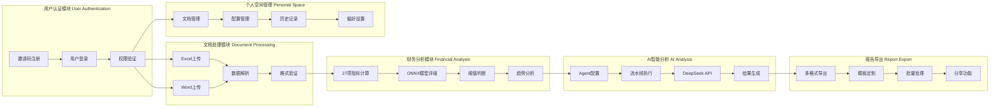

## 📊 智能财报分析系统 - 项目全貌

### 🎯 项目概述
这是一个基于 **Next.js 15.2.4** 的现代化智能财务报表分析系统，集成了**多Agent AI分析**、**ONNX机器学习模型**和**用户个人空间管理**，专为投资者、财务分析师和企业用户设计，提供完整的财务报表分析和智能报告生成解决方案。

### 🏗️ 技术架构

**前端技术栈：**
- **Next.js 15.2.4** - React全栈框架
- **TypeScript** - 类型安全开发
- **Tailwind CSS** - 原子化CSS框架
- **Radix UI** - 无障碍UI组件库
- **Recharts** - 数据可视化图表库
- **Lucide React** - 现代图标库

**AI & 机器学习：**
- **DeepSeek API** - 大语言模型API集成
- **ONNX Runtime** - 企业健康度评级模型
- **多Agent系统** - 可配置的智能分析流水线
- **流式处理** - 实时AI分析结果展示

**数据处理：**
- **xlsx** - Excel文件解析
- **mammoth** - Word文档解析
- **自定义财务数据提取器** - 智能识别财务报表结构
- **27个财务指标计算引擎** - 涵盖偿债、盈利、营运、发展能力分析

**文件处理：**
- **formidable** - 文件上传处理
- **docx** - Word文档生成
- **html2canvas & jsPDF** - 多格式报告导出

### 📁 项目结构

````
├── app/                           # Next.js应用目录
│   ├── api/                       # API路由
│   │   ├── agent/                 # AI Agent执行接口
│   │   ├── upload-docx/           # Word文档上传
│   │   ├── check-model/           # ONNX模型状态检查
│   │   └── financial-data-extractor.ts # 财务数据提取
│   ├── dashboard.tsx              # 主仪表板页面
│   ├── layout.tsx                 # 应用布局
│   └── page.tsx                   # 首页
├── components/                    # React组件
│   ├── dashboard/                 # 仪表板组件
│   │   ├── charts/                # 图表组件
│   │   ├── communication/         # AI通信组件
│   │   ├── financial-metrics/     # 财务指标组件
│   │   ├── modals/                # 模态框组件
│   │   ├── hooks/                 # 自定义Hooks
│   │   ├── types/                 # TypeScript类型定义
│   │   └── utils/                 # 工具函数
│   ├── ui/                        # 基础UI组件
│   ├── excel-preview-container.tsx # Excel预览容器
│   ├── file-upload-sidebar.tsx    # 文件上传侧边栏
│   └── theme-provider.tsx         # 主题提供者
├── public/                        # 静态资源
│   ├── models/                    # ONNX模型文件
│   └── onnx/                      # ONNX运行时文件
├── uploads/                       # 文件上传目录
├── utils/                         # 通用工具函数
│   ├── contentConverter.ts        # 内容转换器
│   └── exportUtils.ts             # 导出工具
└── lib/                           # 核心库文件
````

### ✨ 核心功能模块

#### 🔄 **已实现功能**

##### 1. **文件管理系统** (`FileUploadSidebar`)
- 支持拖拽上传Excel财务报表文件
- 文件列表管理，支持选择和删除
- 存储空间使用情况显示
- 文件预览功能

##### 2. **Excel数据解析与预览** (`ExcelPreviewContainer`)
- 自动识别资产负债表、利润表、现金流量表
- 响应式表格展示，支持排序和滚动
- Tab方式切换不同工作表
- 智能数据格式化处理

##### 3. **财务指标计算系统** (`financial-data-extractor.ts`)
- **27个核心财务指标**自动计算
- 基于Excel数据的智能提取算法
- 详细计算公式展示
- 一键批量计算功能

##### 4. **财务指标总览** (`FinancialMetricsOverview`)
- 27个财务指标卡片式展示
- 基于阈值的健康状态指示（健康/警告/危险）
- 4列响应式网格布局
- 自动数值格式化（%、次、天、倍等单位）

##### 5. **ONNX机器学习集成** (`EnterpriseHealthCard`)
- 企业健康度AI评级（A/B/C/D等级）
- 基于27个财务指标的智能评估
- 实时置信度显示
- 客户端ONNX模型推理

##### 6. **多Agent智能分析系统** (`CommunicationLog`)
- 可配置的AI Agent流水线
- 支持Word文档上传和解析
- DeepSeek API集成
- 流式AI分析结果展示
- 智能报告生成

##### 7. **阈值设置系统** (`ThresholdModal`)
- 按分类管理指标阈值
- 三级阈值设置（健康、警告、危险）
- 实时预览颜色变化
- 本地存储持久化

##### 8. **趋势图功能** (`TrendChart`)
- 鼠标悬浮800ms后显示趋势图
- 支持柱状图和折线图切换
- 三年历史数据对比
- 自动计算变化率

##### 9. **图表展示系统** (`FinancialChartsDisplay`)
- 多指标对比可视化
- 支持年度、季度、月度时间维度
- 升序/降序排列控制
- 交互式数据提示

##### 10. **多格式导出系统** (`exportUtils.ts`)
- 支持PDF、Word、HTML、TXT格式导出
- 智能报告格式化
- 图表和数据完整导出
- 自定义导出选项

#### 🚀 **规划中功能**

##### 11. **用户邀请码注册系统**
- 邀请码验证机制
- 用户注册流程
- 账户激活管理
- 权限级别控制

##### 12. **用户登录认证系统**
- 安全登录验证
- JWT令牌管理
- 会话状态维护
- 密码安全策略

##### 13. **用户个人空间管理**
- 个人文档库管理
- 文档上传/下载功能
- 文档分类和标签
- 存储配额管理

##### 14. **财务指标个人配置**
- 自定义指标阈值
- 个人偏好设置
- 指标显示配置
- 报告模板定制

##### 15. **Agent个人配置系统**
- 个人Agent模板库
- 自定义Prompt管理
- Agent执行历史
- 分析偏好设置

### 🏛️ 系统架构图

#### 📋 技术架构图

> **注意**: 如果您在GitHub上查看此文档，下面的Mermaid图表会自动渲染。如果看不到图表，请查看文本版本的架构描述。

```mermaid
graph TB
    subgraph "前端层 Frontend Layer"
        A[Next.js 15.2.4 应用]
        B[React组件库]
        C[Tailwind CSS样式]
        D[TypeScript类型系统]
    end

    subgraph "业务逻辑层 Business Logic Layer"
        E[财务数据处理]
        F[多Agent AI系统]
        G[ONNX模型推理]
        H[用户管理系统]
    end

    subgraph "API服务层 API Service Layer"
        I[/api/agent - AI Agent]
        J[/api/upload-docx - 文档上传]
        K[/api/check-model - 模型检查]
        L[/api/financial-data-extractor - 数据提取]
    end

    subgraph "数据存储层 Data Storage Layer"
        M[本地文件存储]
        N[localStorage缓存]
        O[用户配置数据]
        P[ONNX模型文件]
    end

    subgraph "外部服务 External Services"
        Q[DeepSeek API]
        R[ONNX Runtime]
        S[文件系统]
    end

    A --> E
    A --> F
    A --> G
    A --> H

    E --> I
    F --> I
    G --> K
    H --> O

    I --> Q
    F --> J
    G --> R

    I --> M
    J --> S
    K --> P
    L --> M
```

**📝 文本版架构说明:**
```
┌─────────────────────────────────────────────────────────────┐
│                        前端层 Frontend Layer                │
│  Next.js 15.2.4 应用 → React组件库 → Tailwind CSS样式      │
│                    → TypeScript类型系统                     │
└─────────────────────────┬───────────────────────────────────┘
                          ↓
┌─────────────────────────────────────────────────────────────┐
│                     业务逻辑层 Business Logic Layer         │
│  财务数据处理 → 多Agent AI系统 → ONNX模型推理 → 用户管理系统 │
└─────────────────────────┬───────────────────────────────────┘
                          ↓
┌─────────────────────────────────────────────────────────────┐
│                      API服务层 API Service Layer           │
│  /api/agent → /api/upload-docx → /api/check-model          │
│                → /api/financial-data-extractor             │
└─────────────────────────┬───────────────────────────────────┘
                          ↓
┌─────────────────────────────────────────────────────────────┐
│                    数据存储层 Data Storage Layer            │
│  本地文件存储 → localStorage缓存 → 用户配置数据 → ONNX模型文件│
└─────────────────────────┬───────────────────────────────────┘
                          ↓
┌─────────────────────────────────────────────────────────────┐
│                      外部服务 External Services             │
│        DeepSeek API → ONNX Runtime → 文件系统              │
└─────────────────────────────────────────────────────────────┘
```

#### 🔄 业务流程架构图



### 📊 财务指标体系

**八大分析维度：**

1. **基本会计数据** (4个指标)
    - 资产总额、负债总额、净资产、所有者权益

2. **偿债能力分析** (5个指标)
    - 流动比率、速动比率、资产负债率、现金比率、现金流动负债比

3. **盈利能力分析** (6个指标)
    - 主营业务毛利率、主营业务净利率、资产净利率、净资产收益率、成本费用利润率、营业费用率

4. **营运能力分析** (5个指标)
    - 应收账款周转率、存货周转率、总资产周转率、应收账款周转天数、存货周转天数

5. **资本状况分析** (2个指标)
    - 资本保值增值率、资本积累率

6. **现金流量分析** (4个指标)
    - 净现比、收现比、现金比率、现金流动负债比

7. **杜邦分析体系** (2个指标)
    - 权益乘数、权益净利率

8. **智能评级分析** (1个指标)
    - 企业健康度AI评级（基于ONNX模型）

### 🎨 界面特色

- **专业深色主题** - 护眼的深色界面设计
- **渐变动画效果** - 流畅的交互动画
- **响应式布局** - 完美适配各种屏幕尺寸
- **状态颜色编码** - 直观的健康状态指示
- **悬浮趋势图** - 创新的hover显示功能
- **粒子背景效果** - 动态背景增强视觉体验

### 🔧 核心组件架构

**主要组件：**
- `Dashboard.tsx` - 主仪表板容器
- `FileUploadSidebar` - 文件上传管理
- `ExcelPreviewContainer` - Excel数据预览
- `FinancialMetricsOverview` - 财务指标总览
- `MetricCard` - 财务指标卡片
- `ThresholdModal` - 阈值设置弹窗
- `TrendChart` - 趋势图组件
- `FinancialChartsDisplay` - 图表展示

**状态管理：**
- 使用自定义Hooks进行状态管理
- localStorage本地数据持久化
- React Context API全局状态

### 🚀 使用流程

#### 📈 **当前版本使用流程**

1. **上传财务报表** → 拖拽Excel文件到上传区域
2. **数据预览** → 查看三张财务报表的数据
3. **计算指标** → 点击"计算财务比率"按钮
4. **查看分析** → 在财务指标总览页面查看结果
5. **AI评级** → 查看ONNX模型生成的企业健康度评级
6. **设置阈值** → 自定义健康状态判断标准
7. **趋势分析** → 悬浮查看指标趋势图
8. **图表展示** → 多维度可视化分析
9. **智能报告** → 上传Word文档，配置AI Agent生成分析报告
10. **导出报告** → 多格式导出分析结果

#### 🔮 **未来版本使用流程**

1. **邀请码注册** → 使用邀请码创建账户
2. **安全登录** → 用户名密码登录系统
3. **个人空间** → 进入个人文档管理中心
4. **文档管理** → 上传、分类、管理个人文档
5. **配置偏好** → 设置个人财务指标和Agent偏好
6. **智能分析** → 使用个人配置进行财务分析

### 📈 项目特点

#### 🎯 **核心优势**

- **🤖 AI驱动** - 集成多Agent系统和ONNX机器学习模型
- **📊 专业分析** - 27个专业财务指标覆盖全面分析维度
- **🔄 智能化** - 自动识别Excel表格结构和数据提取
- **📈 可视化** - 丰富的图表、趋势图和交互式展示
- **⚡ 实时性** - 流式AI分析和实时结果展示
- **🎨 现代化** - 专业深色主题和流畅动画效果
- **📱 响应式** - 完美适配各种屏幕尺寸和设备
- **🔧 可扩展** - 模块化设计便于功能扩展和定制

#### 🚀 **技术亮点**

- **多Agent架构** - 可配置的AI分析流水线
- **ONNX集成** - 客户端机器学习模型推理
- **流式处理** - 实时AI分析结果展示
- **多格式支持** - Excel、Word文档处理和多格式导出
- **智能缓存** - 本地存储优化和性能提升
- **类型安全** - 完整的TypeScript类型系统

#### 🔮 **未来特性**

- **👥 用户系统** - 完整的用户注册、登录和权限管理
- **📁 个人空间** - 文档管理和个人配置中心
- **🎛️ 个性化** - 自定义指标阈值和Agent配置
- **📊 历史追踪** - 分析历史和趋势对比功能
- **🤝 协作功能** - 报告分享和团队协作
- **🔐 企业级** - 数据安全和权限控制
